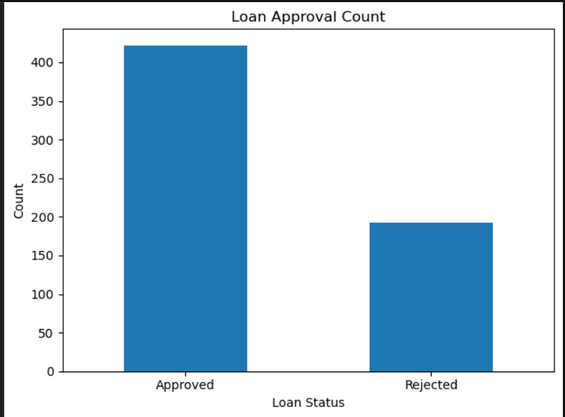
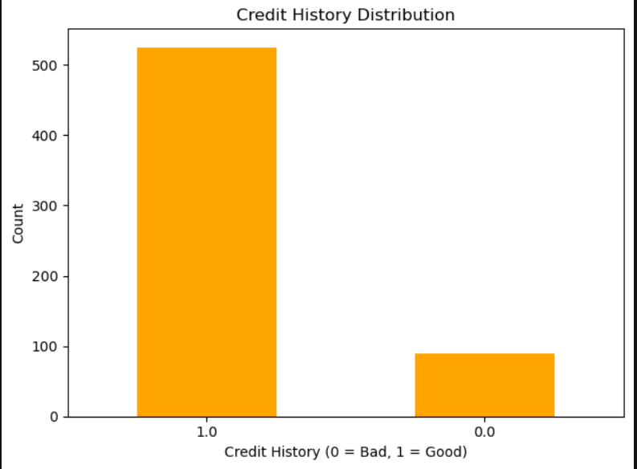
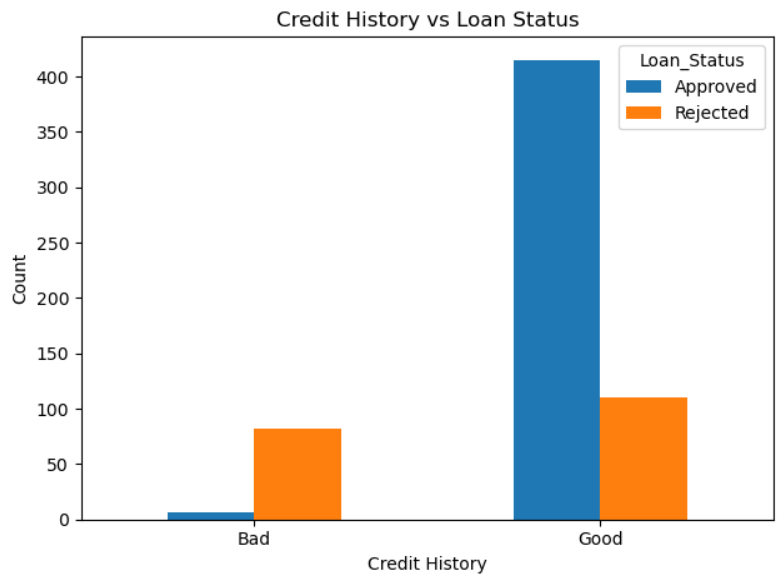
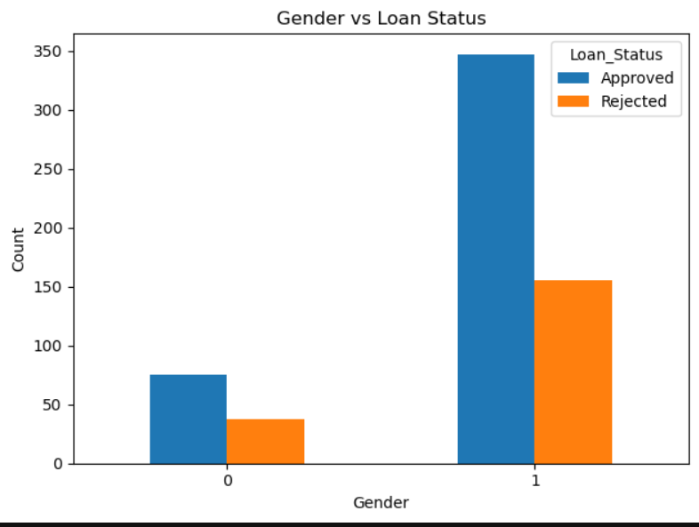
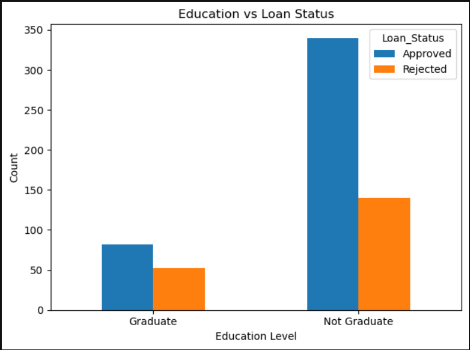
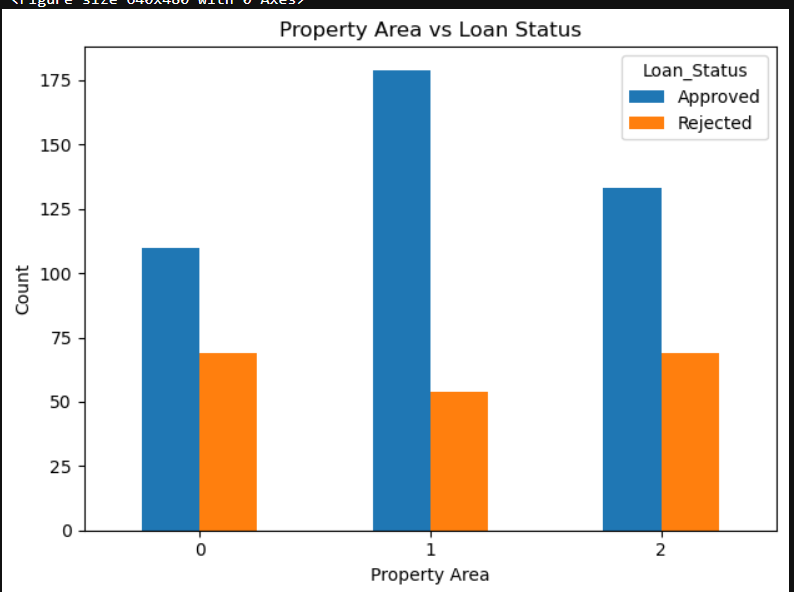

#  Loan Prediction Data Analysis & Machine Learning

##  Overview

This project focuses on analyzing loan applicant data and building a machine learning model to predict whether a loan will be approved or not. The project includes data preprocessing, visualization, and classification using Logistic Regression.

##  Objectives

* Understand the dataset structure
* Handle missing values
* Perform data visualization
* Encode categorical variables
* Train a machine learning model
* Evaluate model performance

##  Dataset

The dataset contains information about loan applicants, including:

* Gender
* Marital Status
* Dependents
* Education
* Employment Status
* Income Details
* Loan Amount
* Credit History
* Property Area
* Loan Status (Target Variable)

##  Data Preprocessing

* Removed unnecessary column: `Loan_ID`
* Handled missing values:

  * Categorical → Mode
  * Numerical → Mean
* Converted `Dependents` from "3+" to 3
* Encoded categorical variables using Label Encoding

##  Data Visualization

### Loan Status Distribution

### Credit History Distribution

### Credit History vs Loan Status

### Gender vs Loan Status

### Education vs Loan Status

### Property Area vs Loan Status

##  Model Building

* Algorithm: Logistic Regression
* Train-Test Split: 80% Training, 20% Testing
* Feature Scaling: StandardScaler applied

##  Model Evaluation

* Accuracy: **~78.8%**
* Confusion Matrix used for evaluation

### Key Insights:

* Credit history is the most important factor
* Applicants with good credit history have higher approval chances
* Model performs well for initial prediction tasks

##  Technologies Used

* Python
* Pandas
* NumPy
* Matplotlib
* Scikit-learn

##  Future Improvements

* Try advanced models (Random Forest, XGBoost)
* Hyperparameter tuning
* Improve accuracy with feature engineering

##  Author

**Khushi Gupta**
B.Tech CSE (AI/ML Aspirant)
